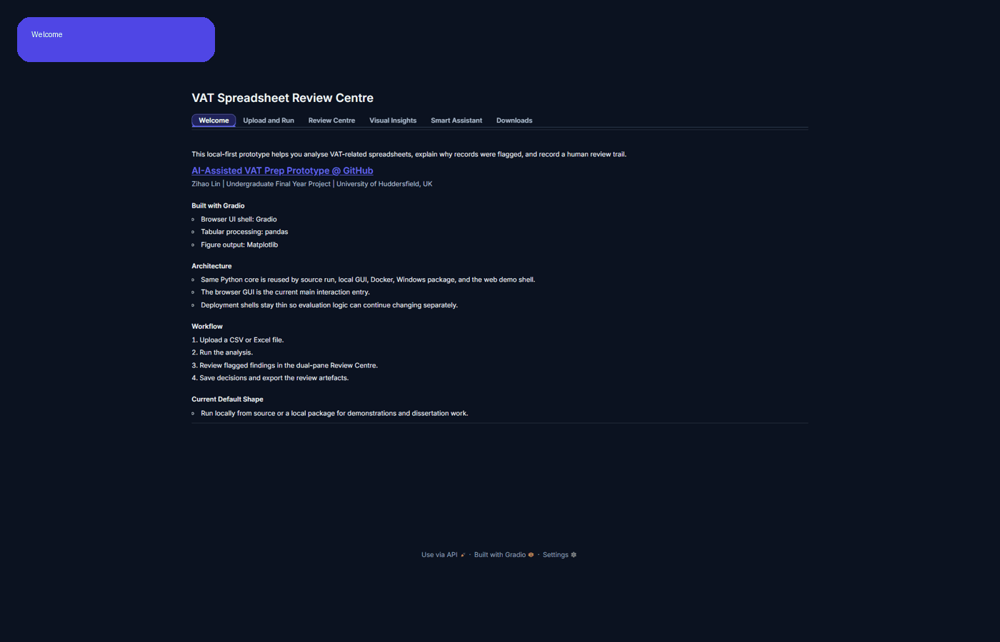
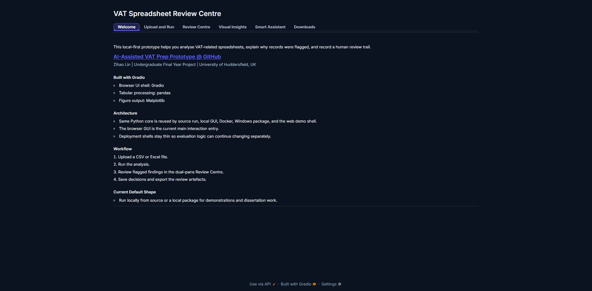
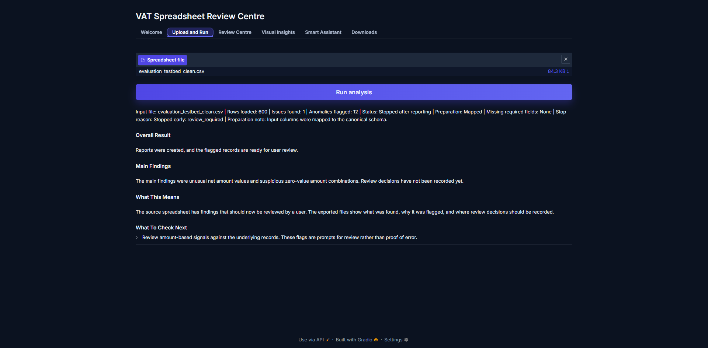
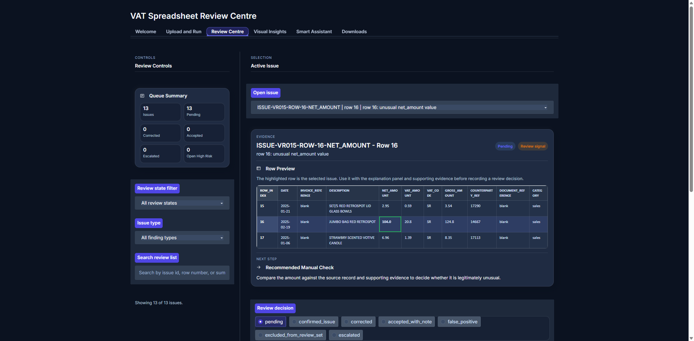
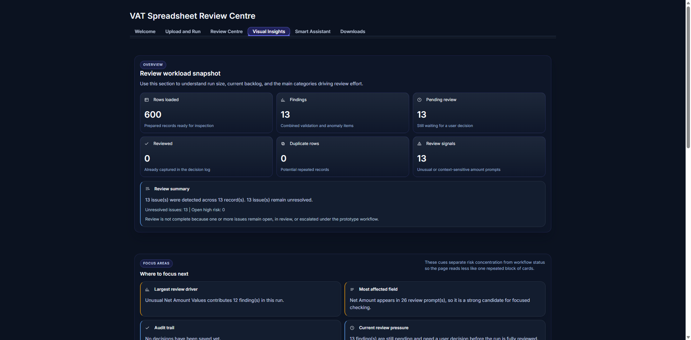
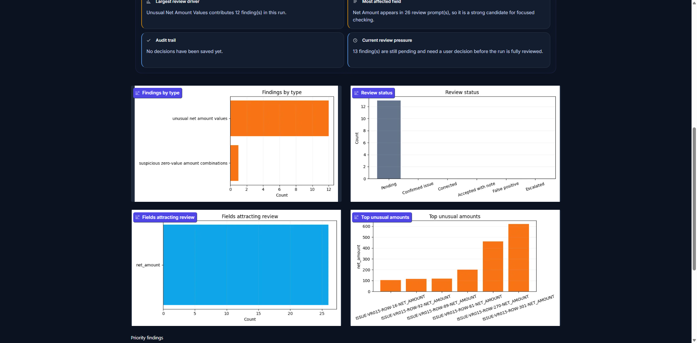
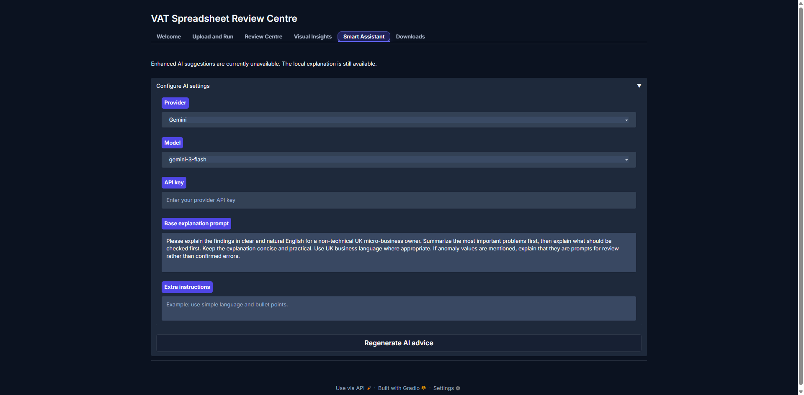
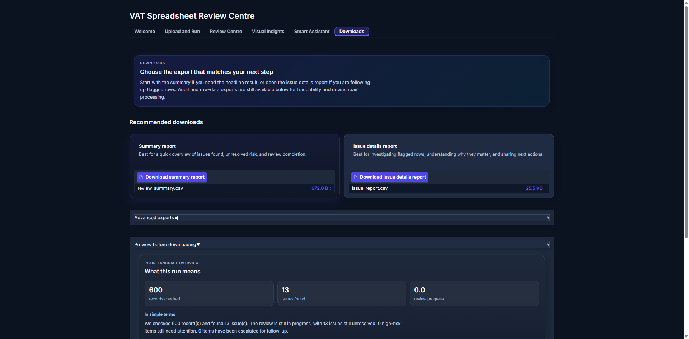
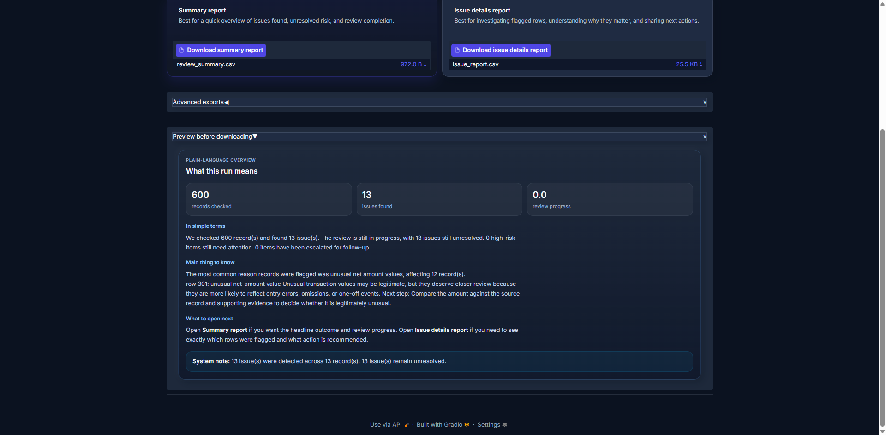
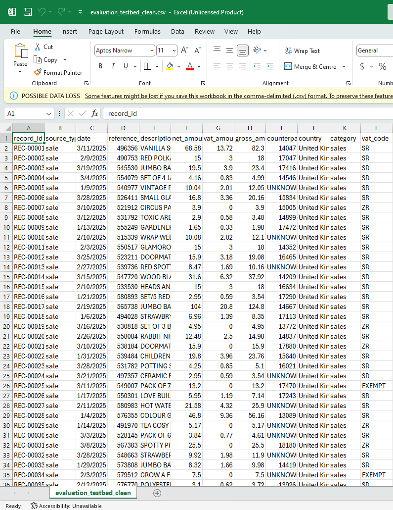

# AI-Assisted VAT Spreadsheet Review Prototype

> A local-first prototype for UK VAT spreadsheet review, combining deterministic checks, anomaly flagging, explanation-oriented review support, and human decision logging.

This repository contains an undergraduate Final Year Project prototype for reviewing spreadsheet-based VAT records before submission. It is designed for CSV or Excel workflows where a user needs help spotting likely issues, understanding why a record matters, and recording a human review decision against flagged items.

The prototype is a review assistant. It is not an HMRC filing client, not a bookkeeping platform, and not a replacement for professional tax judgement.

## Screenshots And Demo

The current browser GUI is organized around a full review workflow rather than a single upload form.

### Demo Flow



### Key Screens

#### Welcome



#### Upload And Run



#### Review Centre



#### Visual Insights





#### Smart Assistant



#### Downloads





#### Example Source Spreadsheet



## What This Project Does

The system takes spreadsheet-style transaction records, maps them into a canonical review structure, runs deterministic validation plus bounded anomaly checks, and exports review artefacts such as issue reports, review logs, and summaries.

In practice, it is intended to answer questions like:

- Which records need manual attention before VAT submission?
- Which findings are deterministic data problems versus review signals?
- Why does a flagged item matter from a VAT-review perspective?
- What decision did the reviewer take, and is that decision traceable later?

## At A Glance

| Aspect | Summary |
| --- | --- |
| Main purpose | Pre-submission VAT spreadsheet review support |
| Typical input | CSV or Excel files with fields such as `date`, `description`, `net_amount`, `vat_amount`, and `category` |
| Typical output | `issue_report.csv`, `review_log.csv`, `review_history.csv`, `review_summary.csv`, and supporting artefacts |
| Interaction model | Local-first and human-in-the-loop |
| Best fit for | Spreadsheet-using SMEs, bookkeepers, students, and project reviewers |
| Not designed for | VAT filing, legal advice, or automated compliance sign-off |

## Who It Is For

- Small businesses or spreadsheet-based finance workflows that need a structured pre-submission review step
- Bookkeepers or project reviewers who want flagged records plus traceable human decisions
- Students, supervisors, and assessors reviewing the prototype as an undergraduate Final Year Project

## Why It Is Useful

- It turns spreadsheet checking into a review workflow instead of a one-off error list.
- It combines deterministic checks with anomaly-style screening so that attention is directed toward likely review points.
- It explains findings in review language rather than only reporting technical errors.
- It keeps the reviewer in control by recording decisions instead of silently rewriting records.

## Example Input Shape

The prototype works with spreadsheet-like transaction tables. A minimal canonical example looks like this:

```csv
date,description,net_amount,vat_amount,category
2026-01-03,Office supplies,120.50,24.10,Office
2026-01-05,Client invoice,1500.00,300.00,Sales
2026-01-07,Travel expense,89.99,18.00,Travel
2026-13-01,Equipment purchase,750.00,150.00,Equipment
```

The system can also ingest wider spreadsheets and map them into this canonical structure during preparation.

## Example Review Results

Instead of returning only a pass/fail result, the prototype produces review-oriented artefacts that support explanation, traceability, and follow-up checking.

Typical outputs include:

- `dataset_snapshot.csv`
- `prepared_canonical_records.csv`
- `issue_report.csv`
- `review_log.csv`
- `review_history.csv`
- `review_summary.csv`
- diagnostic outputs when required fields are missing

In practice, these outputs are meant to answer:

- which records were flagged and why
- which findings are deterministic issues versus review prompts
- what evidence the reviewer checked
- what decision was recorded and whether it can be audited later

## Review Workflow

```text
input spreadsheet
-> canonicalise fields
-> run deterministic validation
-> flag unusual records
-> interpret findings for review
-> capture reviewer decisions
-> export review artefacts
```

## Evaluation Position

This repository does not claim validation on live HMRC systems or on authoritative VAT ground-truth datasets. Instead, it uses several dataset layers for different purposes:

- controlled evaluation cases for rule correctness and workflow checks
- public-source transaction-style datasets for spreadsheet robustness
- demo datasets for walkthroughs and packaging
- supplemental synthetic realism datasets for structure-oriented evaluation

This separation is intentional. Different datasets support different claims, and the project avoids presenting synthetic or adapted data as real SME tax ground truth.

For the controlled poisoning testbed, the project uses two public seed datasets:

- Online Retail II as the sales or output VAT seed, giving UK retail transaction lines with real descriptions and cancellation-capable source records: [Kaggle mirror](https://www.kaggle.com/datasets/mathchi/online-retail-ii-data-set-from-ml-repository)
- Purchase Ledger invoice data as the purchases or input VAT seed, giving enterprise-style procurement descriptions for semantic review and supplier-pattern checks: [Kaggle mirror](https://www.kaggle.com/datasets/nikhil1011/predict-product-category-from-given-invoice)

The current controlled poisoning run produced 119 injected issues in total, recorded in `data/evaluation/poisoning_log.json`.

Issue count summary:

- `duplicate`: 8
- `gross_inconsistency`: 18
- `group_outlier_amount`: 5
- `invalid_date_format`: 15
- `invalid_numeric`: 15
- `missing_value`: 24
- `semantic_risk`: 10
- `vat_math_inconsistency`: 24

Optimization phase summary:

- baseline row-level evaluation on the poisoned testbed: `Precision = 0.2265`, `Recall = 0.9550`
- optimized row-level evaluation after fixing ISO date parsing and preserving `vat_code`: `Precision = 0.8846`, `Recall = 0.8288`
- the main precision gain came from reducing false positives from `362` to `12`, especially by removing widespread `invalid_date_format` and `vat_rate_review_prompt` over-flagging on valid rows

For provenance and evaluation context, see:

- [docs/data_sources.md](docs/data_sources.md)
- [docs/evaluation/evaluation_plan.md](docs/evaluation/evaluation_plan.md)
- [docs/evaluation/evaluation_results.md](docs/evaluation/evaluation_results.md)
- [docs/evaluation/dataset_audit_recommendations.md](docs/evaluation/dataset_audit_recommendations.md)

## Quick Start

### 1. Create A Virtual Environment

Windows:

```bat
python -m venv venv
venv\Scripts\python.exe -m pip install --upgrade pip
venv\Scripts\python.exe -m pip install -r requirements.txt
```

macOS or Linux:

```bash
python3 -m venv venv
venv/bin/python -m pip install --upgrade pip
venv/bin/python -m pip install -r requirements.txt
```

### 2. Run The Shared Pipeline From Source

Windows:

```bat
venv\Scripts\python.exe main.py --input data\demo\sample_data.csv --output-dir output
```

macOS or Linux:

```bash
venv/bin/python main.py --input data/demo/sample_data.csv --output-dir output
```

This is the quickest way to inspect exported review artefacts from source.

### 3. Run The Local Browser GUI

Windows:

```bat
venv\Scripts\python.exe gui.py --host 127.0.0.1 --port 7860
```

macOS or Linux:

```bash
venv/bin/python gui.py --host 127.0.0.1 --port 7860
```

Convenience launchers:

- Windows: `tools\run_demo.bat`
- macOS: `./tools/run_demo_mac.command`

Then open:

```text
http://127.0.0.1:7860
```

If you want a small walkthrough dataset first, use `data/demo/sample_data.csv`.

### 4. Optional Delivery Routes

Build the Windows packaged demo:

```powershell
.\tools\build_demo.ps1
```

Run the Docker demo:

```bash
docker compose up --build
```

More deployment notes are in [docs/deployment.md](docs/deployment.md).

## Key Features

- Deterministic validation for missing values, invalid dates, invalid numeric fields, and duplicate-style issues
- Lightweight anomaly-style flagging for unusual transaction values
- Review-oriented explanation fields such as why a finding matters and what to check next
- Human decision logging with traceable review history
- Local-first processing by default
- Shared Python core reused across source run, browser GUI, Docker demo, and Windows package
- Optional AI interpretation based on compact findings snapshots rather than full spreadsheet upload by default

## Version History

The repository now exposes milestone-style versions so supervisors and reviewers can see how the prototype evolved:

- `v0.1.0`: pipeline prototype baseline
- `v0.2.0`: local review demo milestone
- `v0.3.0`: current packaged evaluation demo milestone

See [CHANGELOG.md](CHANGELOG.md) for the full milestone history and [docs/github_release_notes.md](docs/github_release_notes.md) for ready-to-paste GitHub Release descriptions.

## Project Scope

### In Scope

- CSV and Excel ingestion
- field mapping into a canonical review schema
- deterministic record checks
- bounded anomaly-style review signals
- explanation-oriented review output
- review prioritisation and human decision capture
- export of review artefacts and summaries

### Out Of Scope

- direct HMRC submission
- automatic VAT filing
- legal or tax advice
- guaranteed compliance
- replacement of accountants or bookkeeping systems
- proof of real-world SME deployment readiness

## Repository Structure

- `main.py`: thin source-run entry point
- `gui.py`: local browser GUI entry point
- `pipeline.py`: shared orchestration flow
- `ingestion/`: spreadsheet loading and preparation
- `validation/`: deterministic checks
- `anomaly/`: anomaly-style screening
- `review/`: issue interpretation, queues, and decision persistence
- `export/`: CSV artefact generation
- `scripts/`: evaluation helpers and maintenance utilities
- `data/evaluation/`: controlled evaluation cases
- `data/demo/`: small demo and smoke-test datasets
- `data/public_raw/`: public-source transaction-style inputs
- `data/public_adapted/`: canonicalised public-source robustness inputs
- `data/realism/`: realism generation seeds/calibration
- `data/supplemental/realism/`: supplemental synthetic realism artefacts

## Deployment Notes

The default operating model is local-first:

- the primary interface is the local GUI in `gui.py`
- source run is the clearest reproduction path for dissertation evaluation
- Windows reviewers can use the packaged demo
- Docker provides an environment-consistent demo shell
- the web-facing path is a limited demo mode, not the default product form

AI boundary:

- full uploaded spreadsheets are not sent to AI by default
- optional AI suggestions use compact findings snapshots only
- AI output is supportive and interpretive, not authoritative
- public demo deployments should avoid sensitive files and may disable AI features entirely

Detailed deployment notes are in [docs/deployment.md](docs/deployment.md). Technology references are in [docs/technology_and_attribution.md](docs/technology_and_attribution.md).

## Dissertation / Review Navigation

If you are reading this repository for assessment or project review, the most useful next documents are:

- [docs/domain/project_direction.md](docs/domain/project_direction.md)
- [docs/domain/VAT_review_rules.md](docs/domain/VAT_review_rules.md)
- [docs/domain/VAT_review_workflow.md](docs/domain/VAT_review_workflow.md)
- [docs/evaluation/evaluation_test_pack.md](docs/evaluation/evaluation_test_pack.md)
- [docs/evaluation/evaluation_results.md](docs/evaluation/evaluation_results.md)
- [docs/defense_directory_guide.md](docs/defense_directory_guide.md)

## Acknowledgements

This prototype builds on established open-source tooling for spreadsheet loading, data processing, visualisation, packaging, and local UI delivery. It also uses a mix of controlled, public-source, adapted, demo, and supplemental synthetic datasets for development and evaluation support.

Further attribution notes are in [docs/technology_and_attribution.md](docs/technology_and_attribution.md).
